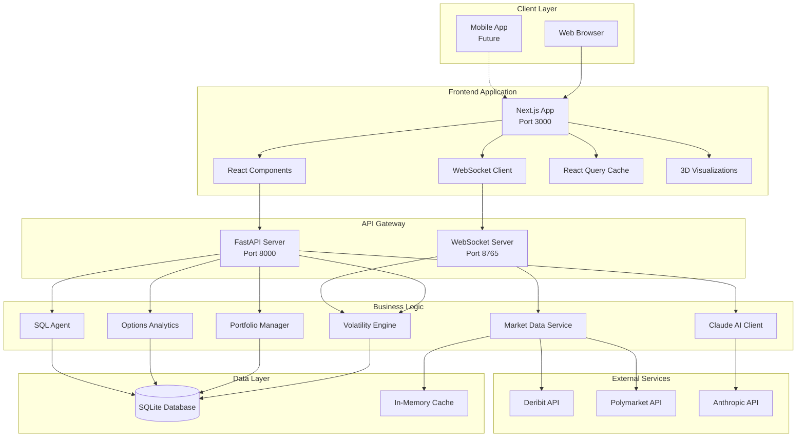
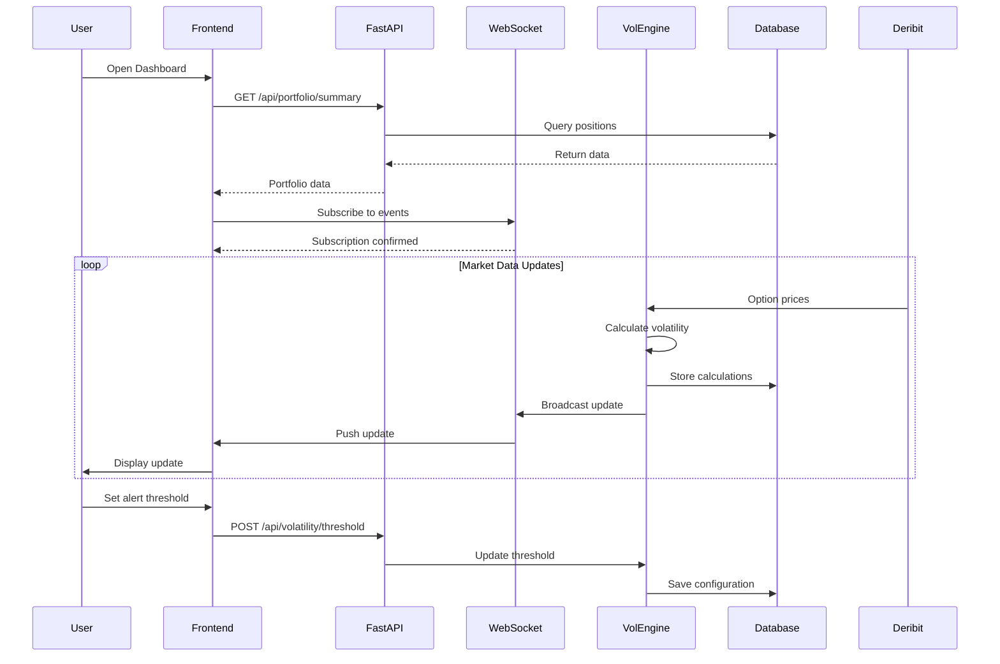
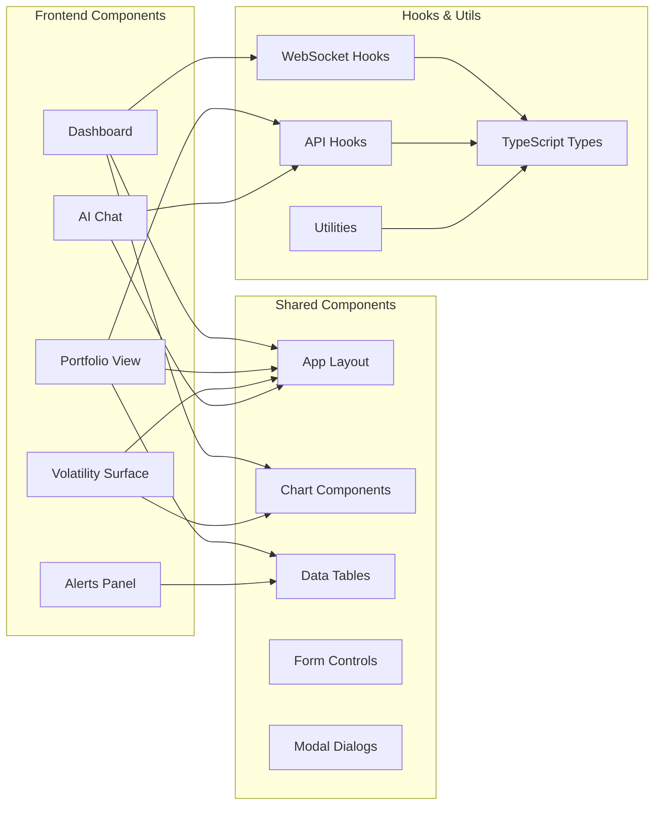
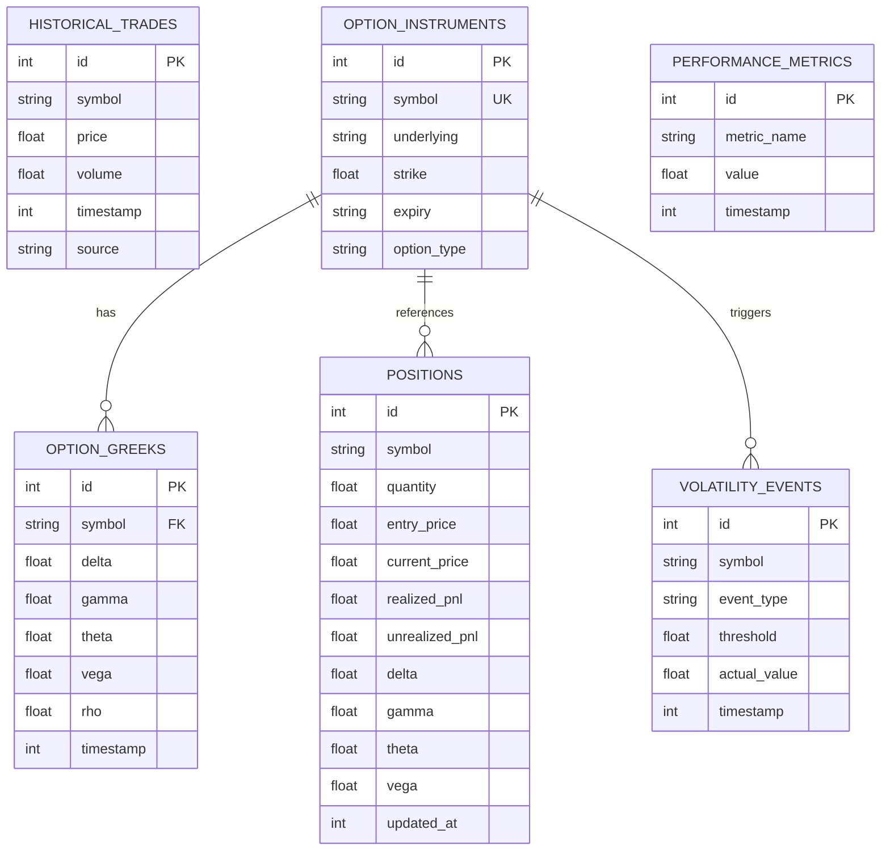
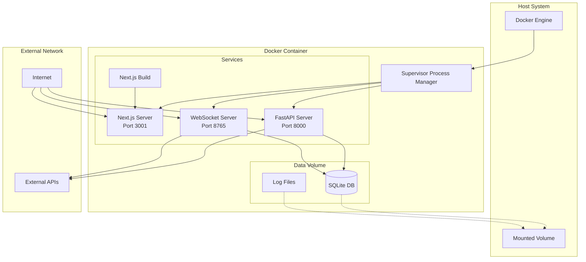
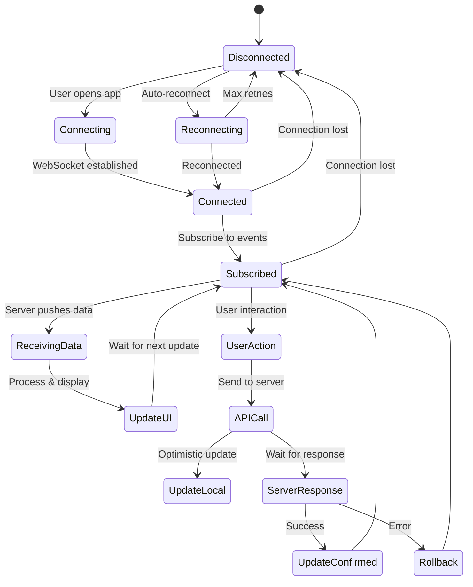
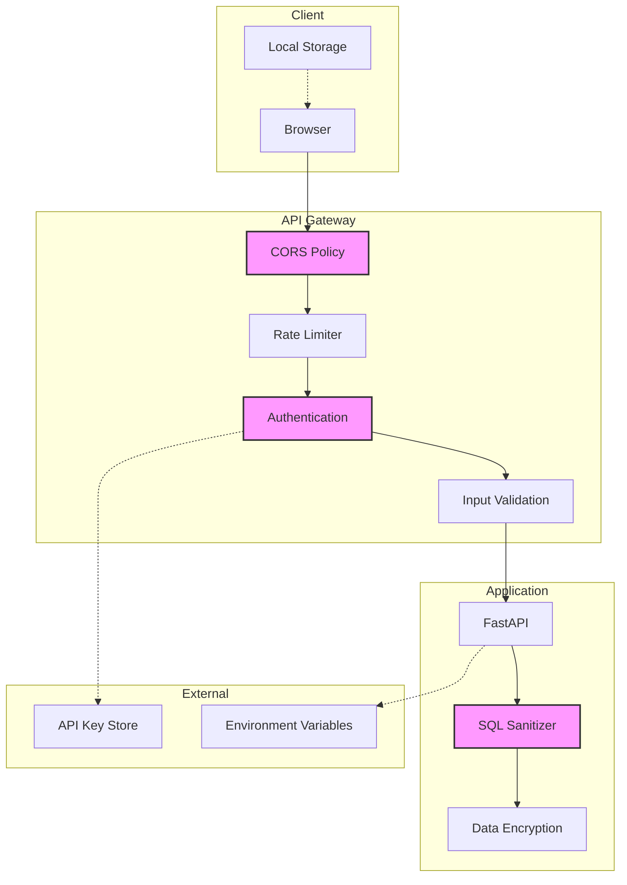
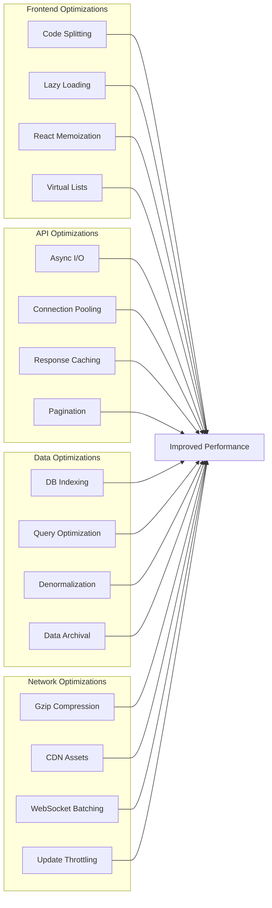

# Architecture Diagrams

## System Architecture

## Data Flow Diagram

## Component Architecture

## Database Schema

## Deployment Architecture

## State Management Flow

## Security Architecture

## Performance Optimization Strategy

These diagrams provide a visual representation of the system architecture, data flows, and key design decisions. They can be rendered in any Markdown viewer that supports Mermaid diagrams.